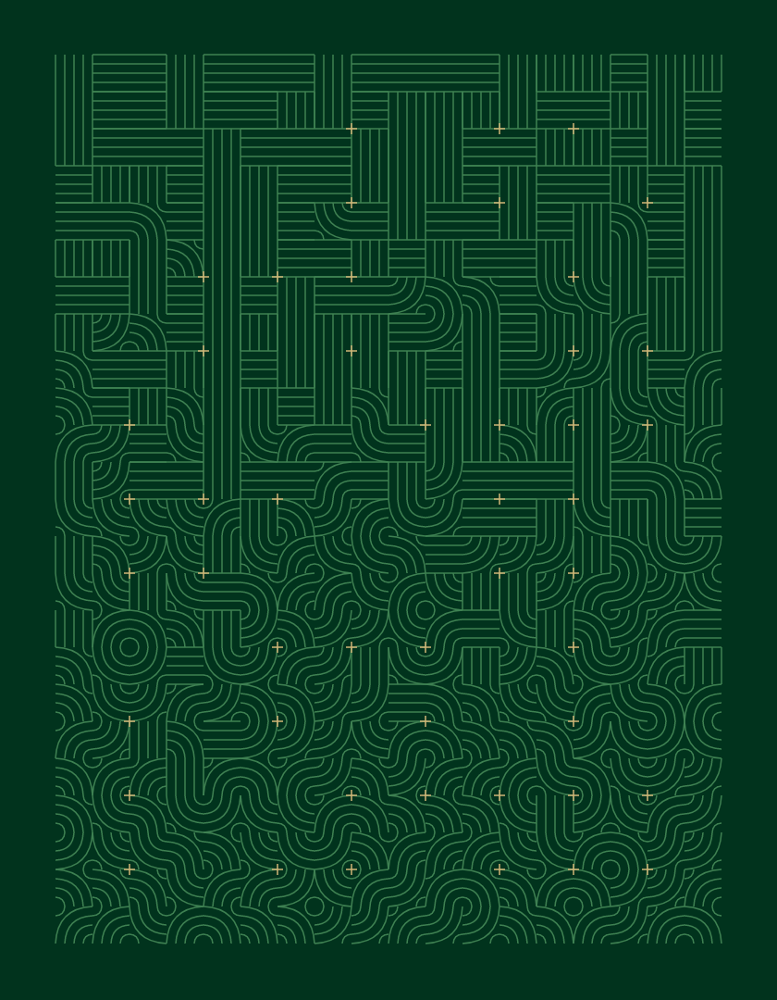
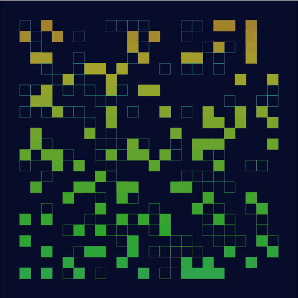

# ReCode

My experiments based on computer art from the 1970s.

Inspired by http://recodeproject.com/

## Structured Square Series

  

http://recodeproject.com/artwork/v1n3structure-square-series-inwards

## Random Squares

http://recodeproject.com/artwork/v1n2random-squares

## Violet, Bleu, Vert, Jaune, Orange, Rouge

https://www.centrepompidou.fr/cpv/resource/cxx585o/ryjG5EL

## Fifteen Etchings

Sol LeWitt: Straight lines in four directions and all their possible combinations.

## 10 PRINT

Classic Commodore 64

## Truchet Tiling

 

https://en.wikipedia.org/wiki/Truchet_tiles

## Blocks

